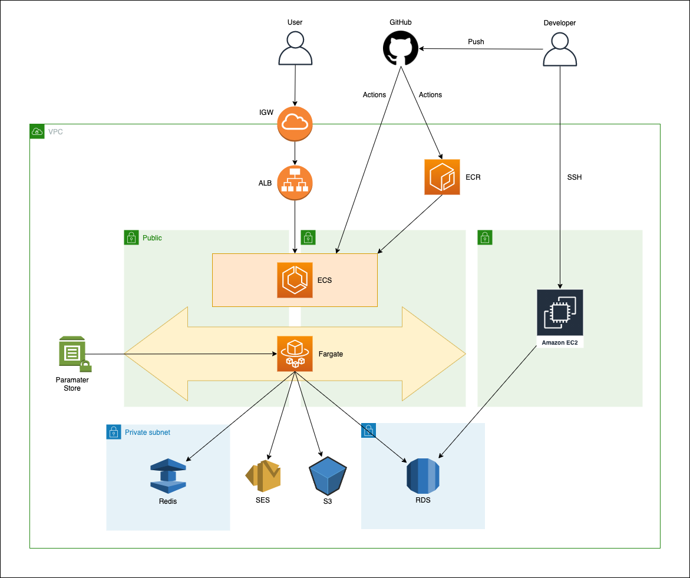

## 概要
小規模サイトを作る場合のECSの構成をTerraformでまとめました。  
※ Publicサブネットに置いている事に抵抗がある方はNatGatewayを作成し、Purivateサブネットに移行してください。

## 構成図


## 作成手順

1. .envの作成
    ```
    $ cp .env.example .env 
    ```

1. .envに環境変数のセット

1. コンテナを立ち上げてterraformのコンテナの中に入る
    ```
    $ docker-compose up -d
    $ docker-compose exec terraform /bin/ash
    ```
1. モジュールの読み込み
    ```
    # terraform init
    ```
   
1. 環境の作成
    ```
    # terraform apply 
    ```
   
## 補足説明
### .dockerディレクトリって何？
Nginx + Laravelを想定した場合のDockerfileをサンプルで格納しています。  
このプロジェクトには使えませんが、サンプルとして配置しています。

### ECSをPublicSubnetに配置している理由は？
そこまで重要度が高いサービスを置く予定がなく、NatGatewayが高いためです。  
セキュリティ面を気にする場合はNatGatewayを使って、PrivateSubnetに置きましょう。

### EC2は何？
RDSをプライベートサブネットに置いていてるため外部からEC2経由で接続します。  
またMigrationを自動化するのは危険なため、EC2から実行します。

### Deploy方法は？
GitHub Actionsで下記の事を行う事を想定しています。
- テスト
- コンテナbuild
- ECRへのPush
- ECSへのDeploy

※ ここではGitHubActionsの設定については触れません。

### 環境変数は？
コンテナに閉じ込める事はあまりせず、AWSのパラメータストアを使ってTask実行時に渡してあげるようにしています。
